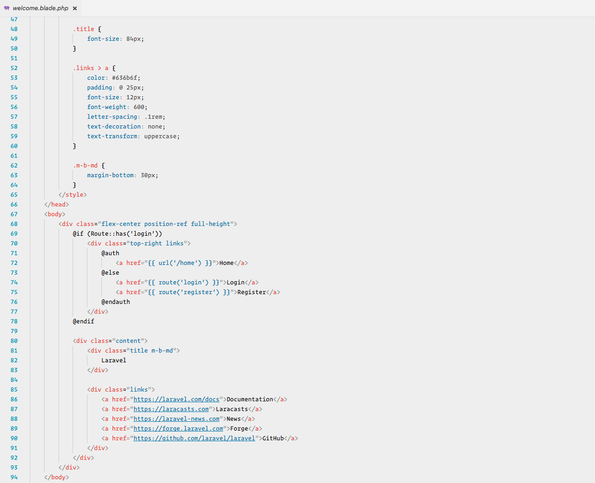

# Laravel Color Theme

Laravel is a Color Theme for Visual Studio Code forked from [Michael Dyrynda](https://twitter.com/michaeldyrynda) original theme for [Sublime Text 3](https://github.com/michaeldyrynda/Laravel.tmTheme). It is inspired by the syntax highlighting found in the official [Laravel documentation](https://laravel.com/docs).

## Installation

### Visual Studio Code Marketplace

You can install this awesome theme through the [Visual Studio Code Marketplace](https://marketplace.visualstudio.com/items?itemName=nsouto.laravel).

## Screenshots

### PHP

### HTML/Blade

### CSS/LESS/SASS

### JavaScript/Vue

### JSON

### XML

### Diff

## Supported languages

This color scheme ought to work with any language in Visual Studio Code, it has been specifically built and tested against languages common to development with Laravel.

* PHP
* MySQL
* HTML/Blade
* JavaScript/Vue
* CSS/Sass/SCSS/Less
* JSON
* XML
* Markdown
* Diff

## About

Created by [Nuno Souto](https://twitter.com/nsouto).

Thanks to [Jack McDade](https://twitter.com/jackmcdade) for creating the original theme as presented in the docs, [Michael Dyrynda](https://twitter.com/michaeldyrynda) for the [Sublime Text 3](https://github.com/michaeldyrynda/Laravel.tmTheme) adaptation and [Taylor Otwell](https://twitter.com/taylorotwell) for creating the framework.